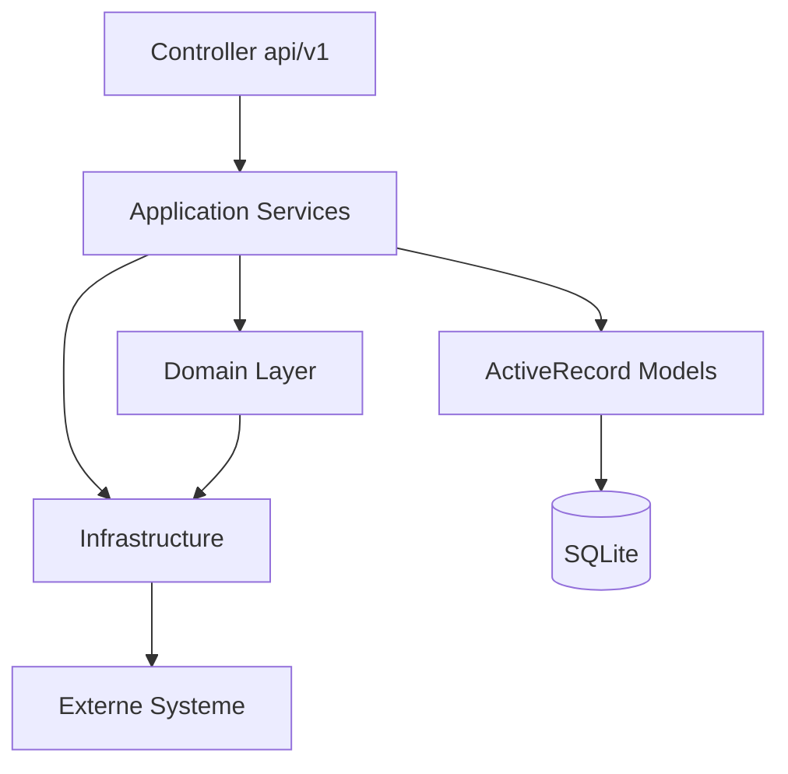
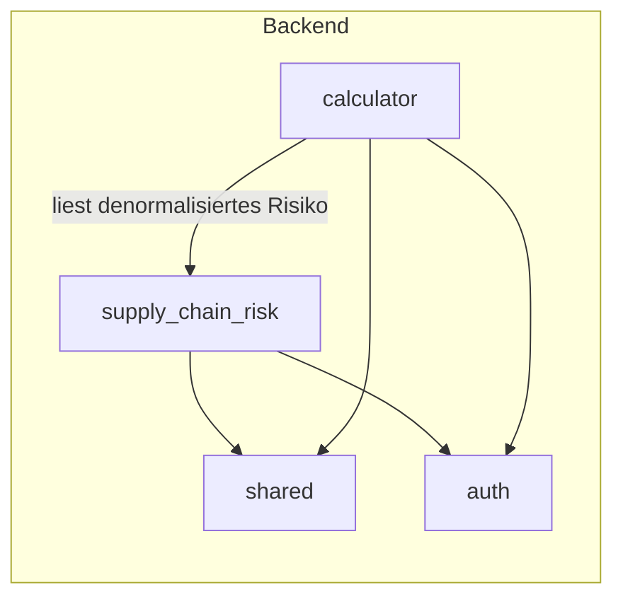
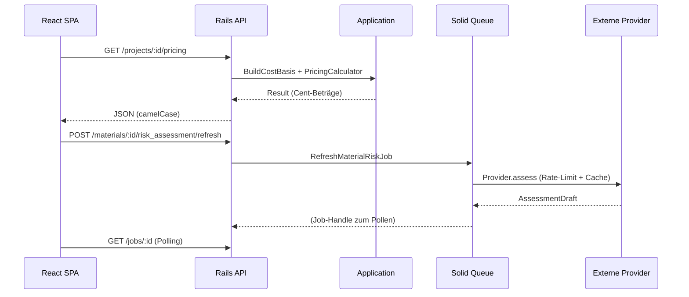

# 02 — Architektur

## Architekturstil

Das Projekt ist ein **modularer Monolith** mit **Domain-Driven Design (DDD)** und
**Ports & Adapters**-Struktur (hexagonale Architektur).

Grundprinzipien (aus `application.rb`, `README.md` und den Modul-Kommentaren):

1. **Ein Modul = ein Ordner** — im Backend `app/modules/<context>` und im Frontend
   `web/src/apps/<modul>`.
2. **Explizite Verdrahtung** — Module werden über `config/initializers` und
   `config/routes.rb` eingebunden, nie über implizite globale Referenzen.
3. **Lazy Loading** — Frontend-Module werden über `module-registry.ts` lazy
   importiert; nicht geöffnete Module werden weder heruntergeladen noch abgefragt.
4. **Entkoppelter Risiko-Kontext** — `supply_chain_risk` kennt den Kalkulator nicht
   und kann später als eigener Service extrahiert werden.

## Schichten (Backend)

| Schicht | Ort | Verantwortung |
|---|---|---|
| HTTP / REST | `app/controllers/api/v1/` | Params, Auth, Serialisierung, Fehler-Envelope (dünn) |
| Application | `app/modules/<ctx>/application/` | Orchestrierung, Transaktionsschritte, Ports |
| Domain | `app/modules/<ctx>/domain/` | reine Geschäftslogik, Value Objects, Policies |
| Infrastructure | `app/modules/<ctx>/infrastructure/` | Adapter, HTTP-Client, Provider-Registry |
| Persistenz | `app/models/` | ActiveRecord (UUID-PKs, Validierung) |
| Jobs | `app/jobs/` | Hintergrundverarbeitung (Solid Queue/async) |

## Bounded Contexts

- **`calculator`** — Kosten-/Preislogik. `BuildCostBasis` lädt das Projekt-Aggregat
  in reine Value Objects; `PricingCalculator`/`PriceOptimizer` rechnen synchron und
  ohne Datenbankzugriff.
- **`supply_chain_risk`** — `RiskDataProvider`-Vertrag, Provider-Registry, Aggregation,
  Ereignis-Ingestion, Benachrichtigungs-Policy.
- **`shared`** — `JsonClient`, `RateLimiter`, `Audit::Recorder`, `JobAdapter`/
  `JobStatus`, `Money`.
- **`auth`** — SQL-gestützte Session-Verwaltung (`Session`/`Session.issue!`/`authenticate`)
  als einzige, autoritative Authentifizierungsquelle (kein JWT-Fallback).

## Abhängigkeitsregeln

- Domain-Schichten sind **frei von Rails-Know-how** (keine ActiveRecord-Queries,
  kein `Rails.cache`/`ENV` direkt). `BuildCostBasis` ist die einzige Stelle, die
  ActiveRecord in Domain-Objekte übersetzt.
- Der `calculator`-Kontext konsumiert das Risiko nur über `AggregateProductRisk`
  und die denormalisierten Spalten `materials.risk_score/risk_level`.
- Provider erhalten ihre Außenwelt ausschließlich über `ProviderContext` (injiziert:
  HTTP, Cache, Logger, Config, Clock) — dadurch testbar und in jedem Prozess lauffähig.

## Kommunikationswege

## Zentrale / stark gekoppelte Komponenten

- **`BuildCostBasis`** ist der zentrale Port zwischen `calculator`-Domain und
  ActiveRecord sowie zwischen `calculator` und `supply_chain_risk`.
- **`ProviderRegistry`/`ProviderCatalogue`** sind die zentrale Stelle, die statischen
  Katalog (`risk_providers.yml`) und Projekt-Konfiguration (`risk_provider_configs`)
  zusammenführt.
- **`AggregateProductRisk`** ist die zentrale Schnittstelle, über die alle anderen
  Teile das Risiko lesen (Dashboard, Pricing, Materialkarte).
- **`JsonClient`** ist der einzige ausgehende HTTP-Client aller Provider.

## Externe Systeme

Nur **ausgehend**, über `JsonClient`: World Bank LPI, GDACS, USGS, Open-Meteo,
ECB/Frankfurter, UN Comtrade, ReliefWeb, OFAC/EU-Sanktionen, Freightos FBX, FRED,
OpenWeather, sowie (optional) ~19 kommerzielle SCRM-/Visibility-Plattformen
(project44, FourKites, Everstream, Resilinc, riskmethods, Interos, D&B, Moody's, …).
Vollständige Liste → [10_interfaces_and_apis.md](10_interfaces_and_apis.md).
