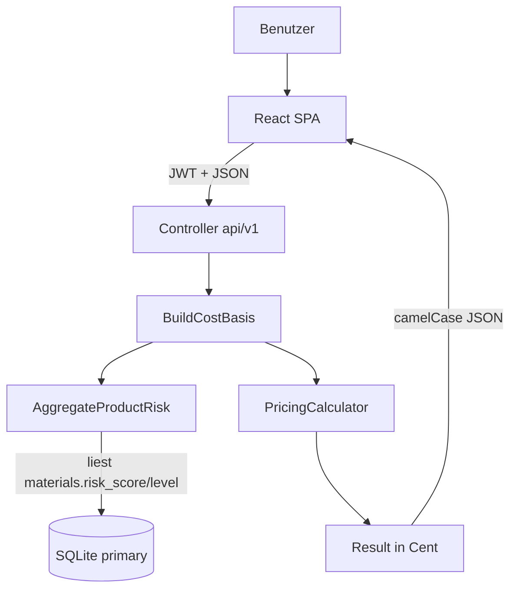
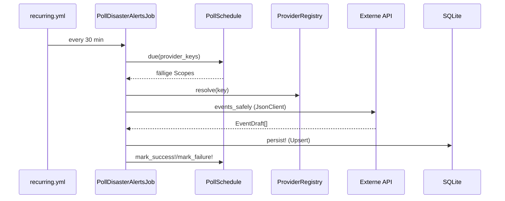

# 07 — Daten- & Kontrollfluss

## Gesamtfluss (vereinfacht)

## Flow: Preiskalkulation (GET /projects/:id/pricing)

1. `PricingController#show` lädt `Project`.
2. `BuildCostBasis.call(project:)` lädt alle Kostenblöcke (`includes`) und ruft
   `SupplyChainRisk::Application::AggregateProductRisk.call(project:)` für den
   Risiko-Input auf.
3. `PricingCalculator.new(basis).call` rechnet synchron und rein in Value Objects.
4. Serialisierung in camelCase (Cent-Beträge).

## Flow: Risiko-Refresh (manuell)

1. `POST /materials/:id/risk_assessment/refresh` → `MaterialRiskController#refresh`.
2. Startet `RefreshMaterialRiskJob.perform_later(material.id)`.
3. Der Job (bzw. der Service `RefreshMaterialRisk`) ermittelt aktive Provider über
   `ProviderRegistry.active_for(project)`, baut je Provider einen `ProviderContext`
   (inkl. Projekt-Overrides) und ruft `provider.assess(subject)`.
4. Jeder Draft wird als `RiskAssessment` (append-only) persistiert.
5. Denormalisierung: `materials.risk_score/risk_level/last_risk_checked_at`.
6. `NotifyRiskAlert.for_material!` (falls 🔴 neu).
7. Aggregation für die Antwort.

## Flow: Provider-Polling (automatisch)

## Flow: In-App-Benachrichtigung

- Neues `RiskEvent` → `EventDraft#persist!` → `NotifyRiskAlert.for_event!` →
  `RiskNotification` (`kind: risk_event`).
- Material 🔴 → `RefreshMaterialRisk` → `NotifyRiskAlert.for_material!` →
  `RiskNotification` (`kind: critical_material`).
- Die SPA pollt `GET /risk_notifications` (30 s), zeigt Badge + Deep-Link zur
  Materialkarte.

## Datenhaltung

- **Drei SQLite-Dateien** je Umgebung (siehe `database.yml`):
  `primary` (App-Daten), `cache` (Solid Cache), `queue` (Solid Queue).
- WAL-Modus + `busy_timeout`, damit Web- und Worker-Prozess sich nicht blockieren.

## Vertragskonventionen

- Monetäre Werte: **ganze Cent** (Integer) durchgängig.
- API spricht **camelCase**, Datenbank **snake_case**.
- Fehler-Envelope: `{ "error": { "code", "message", "details?" } }`.
- Pagination: `{ data, meta: { page, perPage, total, totalPages } }`.
