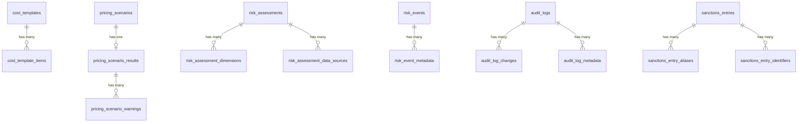

# 19 — JSON → SQL-Migration

> Vollständige Migration des persistenten JSON-Datenmodells auf ein normalisiertes
> relationales SQL-Server-Modell. Keine JSON-Dokumente mehr in `NVARCHAR(MAX)`-Spalten:
> Jede persistente JSON-Struktur wurde analysiert und in relationale Tabellen übersetzt.
> Umsetzung: Migration `api/db/migrate/20260101000008_normalize_json_to_relational.rb`.

## 1. Überblick: welche JSON-Strukturen existierten

Das Schema (`api/db/schema.rb` vor Migration 8) enthielt folgende `json`-Spalten:

| Tabelle | JSON-Spalte | Struktur | Persistente Anwendungsdaten? |
|---|---|---|---|
| `audit_logs` | `changeset` | Hash `{ attr => {from,to} }` + Metadaten | **Ja** (Audit-Trail) |
| `cost_templates` | `items` | Array heterogener Kostenpositionen | **Ja** |
| `pricing_scenarios` | `result_snapshot` | `PriceOptimizer::Result`-Dokument (nested) | **Ja** (historischer Snapshot) |
| `risk_assessments` | `dimensions` | Hash `{ key => score }` | **Ja** |
| `risk_assessments` | `data_sources` | Array von Strings | **Ja** |
| `risk_assessments` | `raw_payload` | externe API-Antwort | Nein — **Sonderfall** (API-Payload) |
| `risk_events` | `metadata` | freies Hash | **Ja** (Provider-Extension) |
| `risk_notifications` | `payload` | Hash (bekannte Schlüssel je `kind`) | **Ja** |
| `risk_provider_configs` | `config` | freie Provider-Konfiguration | Nein — **Sonderfall** (Konfiguration) |
| `sanctions_entries` | `aliases` | Array von Strings | **Ja** |
| `sanctions_entries` | `identifiers` | Hash `{ type => value }` | **Ja** |
| `suppliers` | `sanctions_details` | unstrukturiertes Screening-Ergebnis | Nein — **Sonderfall** (kein Schema, kein Produzent) |

## 2. Sonderfälle (bleiben Text, bewusst nicht normalisiert)

Drei Spalten bleiben als `text` (über `serialize …, coder: JSON` transportiert) erhalten,
weil sie **keine relationale Entität** repräsentieren:

| Spalte | Begründung |
|---|---|
| `risk_assessments.raw_payload` | Roher externer API-Response (Capture zu Audit-Zwecken); beliebig verschachtelt, Schema vom Drittanbieter bestimmt. |
| `risk_provider_configs.config` | Freie Provider-Konfiguration (endpoint/path Overrides, `baseUrl`, `assessmentPath`, `eventsPath`, `tokenUrl`, `mapping`, `appname`, …). |
| `suppliers.sanctions_details` | Unstrukturiertes Screening-Detail; **kein** festes Schema und **kein** aktueller Produzent (nur `apply_sanctions_result!`). |

## 3. JSON → SQL-Mapping

| JSON-Struktur | Ziel-Tabelle | FK | Ordnung |
|---|---|---|---|
| `cost_templates.items[]` | `cost_template_items` | `cost_template_id → cost_templates.id` | `position` |
| `risk_assessments.dimensions{}` | `risk_assessment_dimensions` | `risk_assessment_id → risk_assessments.id` | `position` |
| `risk_assessments.data_sources[]` | `risk_assessment_data_sources` | `risk_assessment_id → risk_assessments.id` | `position` |
| `risk_events.metadata{}` | `risk_event_metadata` | `risk_event_id → risk_events.id` | `position` |
| `audit_logs.changeset{}` (Attribut-Diffs) | `audit_log_changes` | `audit_log_id → audit_logs.id` | `position` |
| `audit_logs.changeset{}` (Metadaten) | `audit_log_metadata` | `audit_log_id → audit_logs.id` | `position` |
| `pricing_scenarios.result_snapshot` (Skalare) | `pricing_scenario_results` | `pricing_scenario_id → pricing_scenarios.id` (unique) | — (1:1) |
| `pricing_scenarios.result_snapshot.warnings[]` | `pricing_scenario_warnings` | `pricing_scenario_result_id → pricing_scenario_results.id` | `position` |
| `risk_notifications.payload{}` | Spalten auf `risk_notifications` | — | — |
| `sanctions_entries.aliases[]` | `sanctions_entry_aliases` | `sanctions_entry_id → sanctions_entries.id` | `position` |
| `sanctions_entries.identifiers{}` | `sanctions_entry_identifiers` | `sanctions_entry_id → sanctions_entries.id` | `position` |

`risk_notifications.payload` wird als typisierte Spalten abgebildet:
`source`, `country_code`, `event_type`, `risk_score`, `risk_level`
(`material_id`/`risk_event_id` existierten bereits als Spalten).

## 4. Datenbank-Placement

Gemäß [18_sql_server.md](18_sql_server.md) sind drei Datenbanken vorgesehen:

| Datenbank | Verantwortung | Tabellen |
|---|---|---|
| `app_data` | Primäres Anwendungsschema | alle Fach-/Domänentabellen inkl. der neuen Kindtabellen |
| `log` | Protokollierung / Audit-Trail | `audit_logs` (+ `audit_log_changes`, `audit_log_metadata`) |
| `users` | Identitäts-Speicher | `users` |

Die Migration ändert nichts an der (bestehenden) Ein-Verbindungs-Architektur: Rails
betreibt aktuell eine einzelne Primärverbindung (`app_data`); `log`/`users` werden von
`DatabaseSetup::Provisioner` angelegt. Das Placement ist als Zielabbildung dokumentiert
und wird durch die Tabellen-Verantwortlichkeit oben ausgedrückt.

## 5. Migrationsprozess (Migration `20260101000008`)

`up`:
1. Kindtabellen erzeugen (FKs, Indizes, Unique-Constraints).
2. Typisierte `risk_notifications`-Spalten ergänzen.
3. Bestehende JSON-Daten **lesen → validieren → mappen → typisieren → einfügen**:
   - Eltern zuerst, dann Kinder (Reihenfolge = FK-Abhängigkeit).
   - `position` erhält die Array-/Hash-Reihenfolge (Ordnungssemantik).
   - Primärschlüssel der Eltern bleiben erhalten; Kinder erhalten neue UUIDs.
4. JSON-Spalten entfernen (`remove_column`).
5. Sonderfall-Spalten `json → text` umwandeln.

`down` (reversibel):
1. JSON-Spalten wieder anlegen.
2. Kindtabellen **zurück** in die JSON-Spalten schreiben.
3. Typisierte Spalten entfernen, Kindtabellen löschen.

**Idempotenz:** Die Migration läuft über die ActiveRecord-Versionierung genau einmal.
Backfills überspringen leere Quellen und verwenden `INSERT` mit Batch-Größe 200.
Die Original-JSON-Daten werden nicht gelöscht, bevor die Kindtabellen vollständig
befüllt sind (erst `insert_rows`, dann `remove_column`).

## 6. Resultierende Tabellen (Spalten & Typen)

Alle Tabellen verwenden String-UUID-PKs (`nvarchar(36)`) und `created_at`/`updated_at`
(`datetime2`). SQL-Server-Typen werden aus den Rails-Abstraktionen abgeleitet:
`string → nvarchar`, `text → nvarchar(max)`, `integer → int`, `boolean → bit`,
`decimal → numeric`, `datetime → datetime2`.

### `cost_template_items`
| Spalte | Typ | Constraint |
|---|---|---|
| `cost_template_id` | nvarchar(36) | FK → `cost_templates.id`, NOT NULL, index |
| `position` | int | NOT NULL, default 0 (Reihenfolge) |
| `category` | nvarchar | NOT NULL, default `other` |
| `name` | nvarchar | NOT NULL |
| `amount_cents` | int | NOT NULL, default 0 |
| `is_recurring` | bit | NOT NULL, default 1 |
| `notes` | nvarchar(max) | NULL |
| `employee` | nvarchar | NULL |
| `role` | nvarchar | NULL |
| `hours` | numeric(12,2) | NULL |
| `hourly_rate_cents` | int | NULL |
| `allocation_basis` | nvarchar | NOT NULL, default `per_unit` |

### `risk_assessment_dimensions`
| Spalte | Typ | Constraint |
|---|---|---|
| `risk_assessment_id` | nvarchar(36) | FK → `risk_assessments.id`, NOT NULL |
| `dimension_key` | nvarchar | NOT NULL |
| `score` | int | NOT NULL, 0..100 |
| `position` | int | NOT NULL |

Unique `(risk_assessment_id, dimension_key)`.

### `risk_assessment_data_sources`
| Spalte | Typ | Constraint |
|---|---|---|
| `risk_assessment_id` | nvarchar(36) | FK, NOT NULL |
| `name` | nvarchar | NOT NULL |
| `position` | int | NOT NULL |

### `risk_event_metadata`
| Spalte | Typ | Constraint |
|---|---|---|
| `risk_event_id` | nvarchar(36) | FK, NOT NULL |
| `key` | nvarchar | NOT NULL |
| `value` | nvarchar(max) | JSON-kodiert (Typ-Erhalt) |
| `position` | int | NOT NULL |

### `audit_log_changes`
| Spalte | Typ | Constraint |
|---|---|---|
| `audit_log_id` | nvarchar(36) | FK, NOT NULL |
| `attribute_name` | nvarchar | NOT NULL |
| `old_value` | nvarchar(max) | JSON-kodiert |
| `new_value` | nvarchar(max) | JSON-kodiert |
| `position` | int | NOT NULL |

### `audit_log_metadata`
| Spalte | Typ | Constraint |
|---|---|---|
| `audit_log_id` | nvarchar(36) | FK, NOT NULL |
| `key` | nvarchar | NOT NULL |
| `value` | nvarchar(max) | JSON-kodiert |
| `position` | int | NOT NULL |

### `pricing_scenario_results` (1:1)
| Spalte | Typ | Constraint |
|---|---|---|
| `pricing_scenario_id` | nvarchar(36) | FK, NOT NULL, **unique** |
| `target_price_cents` / `target_includes_tax` / `target_net_cents` / `target_gross_cents` | int / bit / int / int | NULL |
| `calculated_net_cents` / `calculated_gross_cents` | int | NULL |
| `profit_*` (8 Spalten) | int / numeric(10,6) | NULL |
| `revenue_monthly_net_cents` / `revenue_monthly_gross_cents` / `revenue_batch_net_cents` / `revenue_batch_gross_cents` | int | NULL |
| `monthly_profit_net_cents` / `monthly_profit_margin_pct` / `monthly_profit_units_per_month` | int / numeric / int | NULL |
| `break_even_units_per_month` / `break_even_revenue_net_cents` / `break_even_feasible` / `break_even_reason` / `break_even_coverage_ratio_pct` / `break_even_current_volume` | int / int / bit / nvarchar(max) / numeric / int | NULL |
| `variable_cost_per_unit_cents` / `variable_cost_share_of_price_pct` | int / numeric | NULL |
| `fixed_cost_per_month_cents` / `fixed_cost_per_unit_at_volume_cents` | int | NULL |

### `pricing_scenario_warnings`
| Spalte | Typ | Constraint |
|---|---|---|
| `pricing_scenario_result_id` | nvarchar(36) | FK → `pricing_scenario_results.id`, NOT NULL |
| `position` | int | NOT NULL |
| `message` | nvarchar(max) | NOT NULL |

### `sanctions_entry_aliases`
| Spalte | Typ | Constraint |
|---|---|---|
| `sanctions_entry_id` | nvarchar(36) | FK, NOT NULL |
| `name` | nvarchar | NOT NULL |
| `position` | int | NOT NULL |

### `sanctions_entry_identifiers`
| Spalte | Typ | Constraint |
|---|---|---|
| `sanctions_entry_id` | nvarchar(36) | FK, NOT NULL |
| `identifier_type` | nvarchar | NOT NULL |
| `value` | nvarchar | NULL |
| `position` | int | NOT NULL |

## 7. Beziehungen

## 8. Verbleibende JSON-Nutzung

JSON bleibt ausschließlich als **Austausch-/Capture-Format** erhalten — nie als primäre
Persistenz:

| Nutzung | Zweck |
|---|---|
| `Calculator::Application::ProjectDocument` | Projekt-Export/Import (Austauschformat). Import validiert und schreibt in SQL. |
| `Shared::Infrastructure::Http::JsonClient` | Externe Provider-APIs liefern JSON (parsen, nie persistieren). |
| `serialize …, coder: JSON` (3 Sonderfälle) | `raw_payload`, `config`, `sanctions_details` (siehe §2). |
| `RiskEventMetadatum`/`AuditLog*`-Werte | JSON-kodierte *skalare* Werte in Text-Spalten (Typ-Erhalt). |

## 9. Import/Export-Verhalten

- **Export** (`GET /projects/:id/export?format=json|csv`): erzeugt ein portables
  JSON-Dokument aus den SQL-Relationen (`ProjectDocument.build`). JSON bleibt
  Austauschformat.
- **Import** (`POST /projects/:id/import`): liest das JSON-Dokument, validiert und
  konvertiert es in SQL-Zeilen (`ProjectDocument.apply!`).
- **Architektur:** `SQL Server → Datenmodell → optionaler JSON-Export` und
  `JSON-Import → Validierung → SQL Server` — nicht umgekehrt.

## 10. Application-Logik (Migration)

| Vorher (JSON) | Nachher (SQL) |
|---|---|
| `CostTemplate#normalised_items` parst `items`-JSON | liest `cost_template_items` |
| `CostTemplate#item_count/total_cents` über JSON | `items.size` / `items.sum(:amount_cents)` |
| `RiskAssessment#dimension_scores` über `dimensions`-JSON | liest `risk_assessment_dimensions` |
| `RiskAssessment#data_sources` über `data_sources`-JSON | liest `risk_assessment_data_sources` |
| `RiskEvent#metadata` über `metadata`-JSON | liest `risk_event_metadata` |
| `RiskNotification#payload` über `payload`-JSON | rekonstruiert aus typisierten Spalten |
| `Audit::Recorder` schreibt `changeset` | schreibt `audit_log_changes` + `audit_log_metadata` |
| `SanctionsEntry.sync!` upserted `aliases`/`identifiers` | ersetzt Kindzeilen |
| `PricingScenario#result_snapshot`-Spalte | `store_result!` / `result_snapshot` über `pricing_scenario_results` |

Die REST-Serializer bleiben **unverändert** (camelCase-Vertrag); die Modelle stellen
dieselben Zugriffsmethoden bereit, die nun aus den Kindtabellen rekonstruiert werden.
`LegacyMigration` (SQLite → SQL Server) wurde um die neuen Kindtabellen erweitert,
damit der Bootstrap die normalisierten Daten vollständig migriert.

