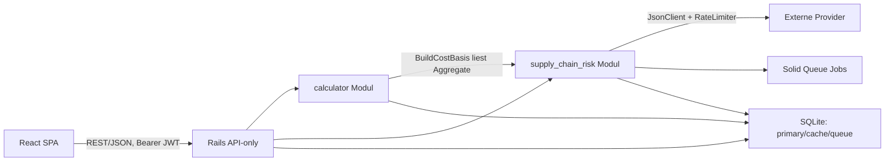

# Projektdokumentation — God Engine

> Technische Dokumentation der **Verkaufspreis-Kalkulationsplattform** mit integriertem
> **Lieferrisiko-Frühwarnsystem (Supply Chain Risk Intelligence)**.
>
> Diese Dokumentation wurde ausschließlich durch **Lesen und Analysieren** des
> bestehenden Quellcodes erstellt. Es wurden keine Projektdateien verändert.

---

## 1. Was ist das Projekt?

**God Engine** ist eine modulare Web-Plattform zur **Produkt- und Verkaufspreiskalkulation**
mit integriertem **Lieferrisiko-Management**. Sie berechnet aus Material-, Monats-,
Arbeits- und Fixkosten einen Verkaufspreis (netto/brutto) und sichert diesen durch
einen risikogekoppelten Zuschlag ab, der aus einem aggregierten
Lieferketten-Risikoscore (0–100) abgeleitet wird.

Das Projekt ist als **modularer Monolith** aufgebaut: Jeder Anwendungsbereich ist ein
eigenständiges Modul mit eigener API, eigener UI, eigener Geschäftslogik und eigenen
Tests. Module werden erst geladen, wenn sie geöffnet werden.

## 2. Zweck

- Einheitliche Preiskalkulation über fünf Tabs (Materialkosten → Monatskosten →
  Fix-/Gemeinkosten → Preiskalkulation → Dashboard).
- Frühwarnung vor Lieferrisiken durch eine **Provider-Abstraktion**, die Open-Data-
  Quellen (kostenlos) und kommerzielle SCRM-/Visibility-APIs (optional) hinter
  **derselben Schnittstelle** (`RiskDataProvider`) vereint.
- Ein Betriebsmodell **ohne Docker/PostgreSQL/Redis** — nur SQLite + Rails 8
  (Solid Cache / Solid Queue).

## 3. Grundlegender Aufbau

```text
god_engine/
├── api/      Rails 8 API-only Backend (modularer Monolith, DDD)
├── web/      React 19 SPA (TypeScript, Vite, MUI, TanStack Query, Zustand)
├── .dev-notes/    Entwicklungs-Notizen (Logs, Statusberichte)
├── .dev-tools/    CA-Bundle + Install-Skripte (Windows-TLS-Helfer)
├── start-dev.ps1 / start-dev.bat / stop-dev.ps1
├── README.md / LICENSE / versioning.md
└── project_documentation/   ← diese Dokumentation
```

## 4. Verwendete Technologien

| Schicht | Technologie |
|---|---|
| Backend | Ruby ≥ 3.3, Rails 8 (API-only), SQLite, Solid Cache, Solid Queue |
| Auth/Sicherheit | bcrypt, JWT (HS256), Rack::Attack, Rack::Cors |
| HTTP (ausgehend) | Faraday (+ Retry/Follow-Redirects) |
| Validierung/Export | json_schemer, caxlsx (XLSX), csv, prawn (PDF) |
| Frontend | React 19, TypeScript, Vite, Material UI, TanStack Query, Zustand, Recharts |
| Tests | RSpec (Backend), Vitest + Playwright (Frontend) |

## 5. Wo startet das Programm?

| Dienst | Einstieg | URL |
|---|---|---|
| API | `api/bin/rails server` (Puma) über `api/config.ru` | http://127.0.0.1:3000/api/v1 |
| SPA | `web/src/main.tsx` → `App.tsx` → `AppShell` | http://127.0.0.1:5173 |
| Health | Rails-Health-Route | http://127.0.0.1:3000/up |
| Dev-Komplettstart | `.\start-dev.bat` bzw. `start-dev.ps1` | — |

## 6. Hauptkomponenten

- **`calculator`** (Backend `app/modules/calculator`, Frontend `apps/calculator`) —
  Kalkulations-Engine: `PricingCalculator`, `PriceOptimizer`, `RiskSurchargePolicy`,
  `LeadTimeAnalyzer`. Vollständig implementiert (Tabs 1–5).
- **`supply_chain_risk`** (Backend `app/modules/supply_chain_risk`) — Provider-Abstraktion,
  Aggregation, Frühwarn-Events, Benachrichtigungen, Hintergrundjobs.
- **`shared`** (Backend `app/modules/shared`) — Querschnitt: `JsonClient`,
  `RateLimiter`, `Audit::Recorder`, `JobAdapter`/`JobStatus`, `Money`.
- **`auth`** — JWT-Ausstellung/-Prüfung.
- **REST-Schicht** — `app/controllers/api/v1/*` (dünn, nur HTTP + Params).
- **Models** — `app/models/*` (ActiveRecord, UUID-Primärschlüssel).
- **Frontend-Shell** — `web/src/shared/module-registry.ts` (zentrale Modul-Registry, Lazy Loading).

## 7. Wie hängen die Komponenten zusammen?



Der `calculator`-Kontext liest ausschließlich die denormalisierten Risiko-Spalten
(`materials.risk_score/risk_level`) und fragt nie die Risiko-Tabellen selbst ab —
dadurch bleiben beide Kontexte entkoppelt (und später als eigener Service extrahierbar).

## 8. Übersicht der Dokumente

| Dokument | Inhalt |
|---|---|
| [01_project_overview.md](01_project_overview.md) | Projektübersicht & Zweck |
| [02_architecture.md](02_architecture.md) | Architektur, Schichten, Diagramme |
| [03_directory_structure.md](03_directory_structure.md) | Ordner-/Dateistruktur |
| [04_modules.md](04_modules.md) | Bounded Contexts / Module |
| [05_classes_and_components.md](05_classes_and_components.md) | Klassen, Models, Controller, Jobs |
| [06_functions_and_logic.md](06_functions_and_logic.md) | Kernlogik & Algorithmen |
| [07_data_flow.md](07_data_flow.md) | Daten- & Kontrollfluss |
| [08_dependencies.md](08_dependencies.md) | Dependencies (Gemfile/package.json) |
| [09_configuration.md](09_configuration.md) | Konfiguration & Umgebungsvariablen |
| [10_interfaces_and_apis.md](10_interfaces_and_apis.md) | REST-API & interne Schnittstellen |
| [11_database_and_models.md](11_database_and_models.md) | Datenmodell & Persistenz |
| [12_testing.md](12_testing.md) | Teststrategie & -abdeckung |
| [13_build_and_deployment.md](13_build_and_deployment.md) | Build, Start, Deployment |
| [14_security.md](14_security.md) | Authentifizierung, Autorisierung, Sicherheit |
| [15_known_issues.md](15_known_issues.md) | Bekannte Probleme & Einschränkungen |
| [16_improvement_opportunities.md](16_improvement_opportunities.md) | Verbesserungspotenziale |
| [17_glossary.md](17_glossary.md) | Glossar |
| [18_sql_server.md](18_sql_server.md) | Microsoft SQL Server (optionales Backend, Ersteinrichtung, Migration) |
| [modules/](modules/README.md) | Detaildokumentation je Modul |

---

## Hinweis zum Erstellungsprozess

Diese Dokumentation ist ein **Snapshot** des Standes zum Erstellzeitpunkt. Änderungen
im Code werden nicht automatisch nachgezogen. Für den Fortschrittsverlauf siehe die
bereits im Projekt vorhandene Datei `versioning.md` im Wurzelverzeichnis.

- **Frontend-Shell** — `web/src/shared/module-registry.ts` (Lazy Loading je Modul).
